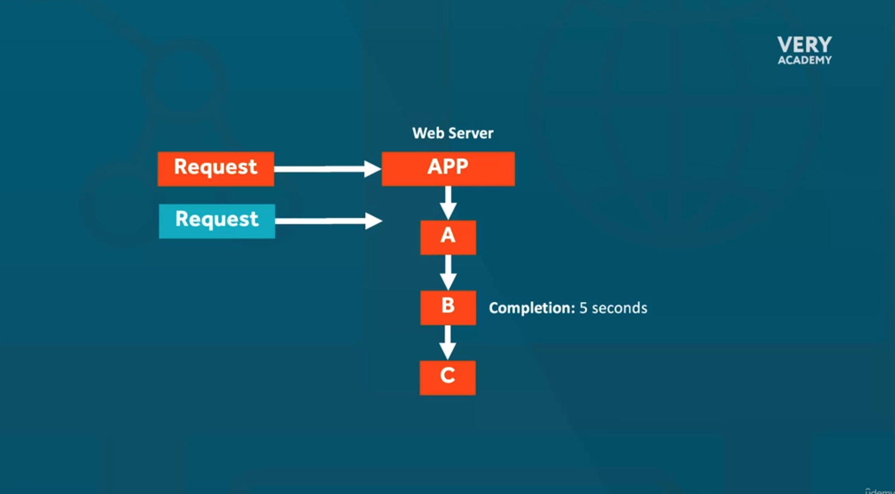
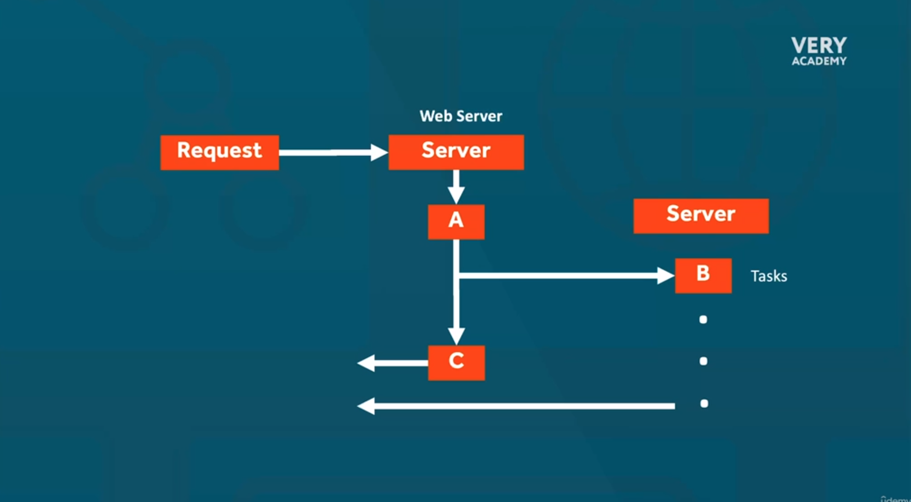
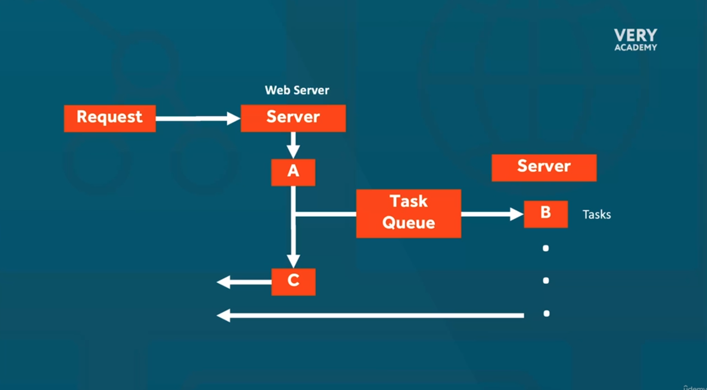
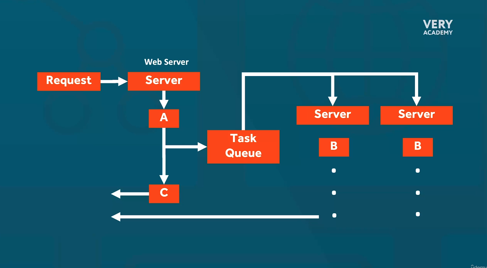
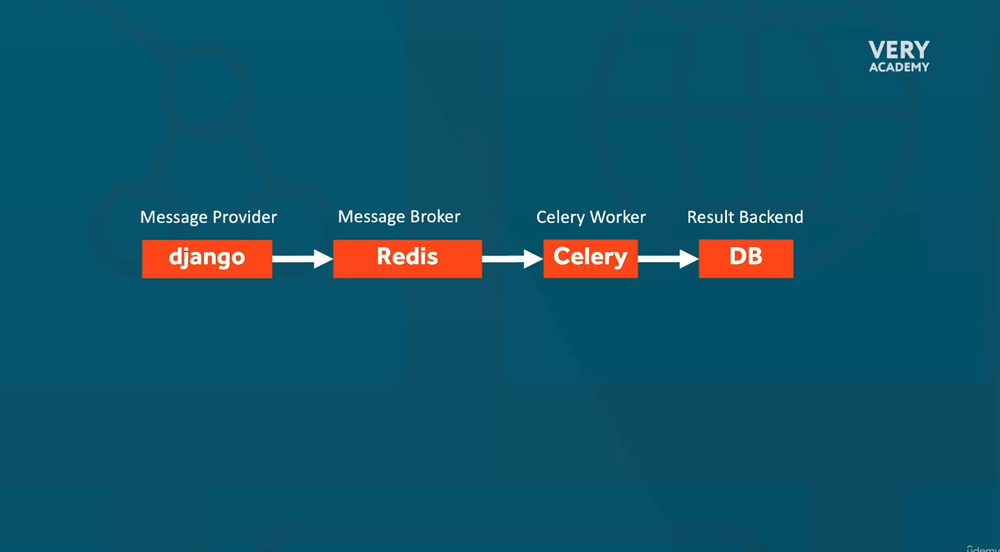
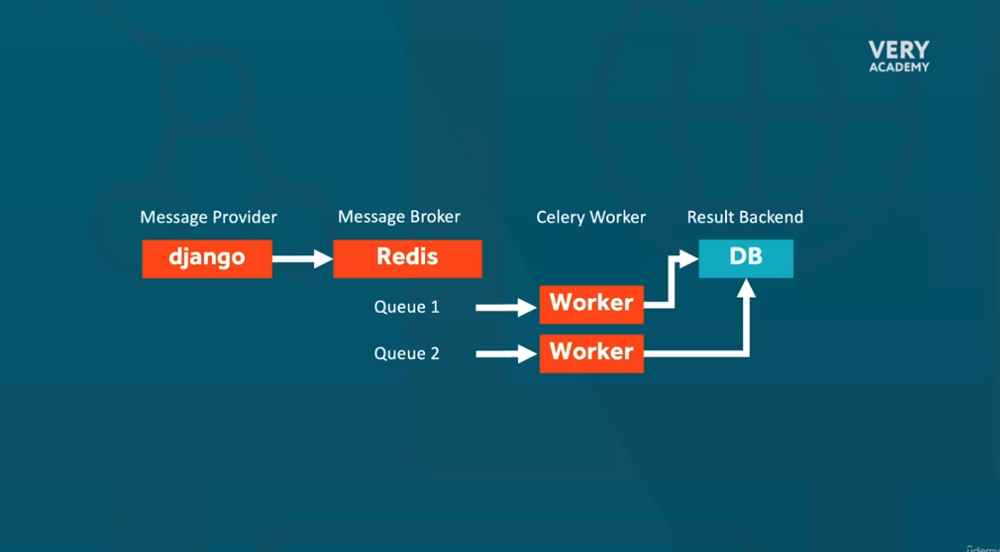

# Django Celery Mastery: Python Asynchronous Task Processing

## Install Python

```bash
sudo apt-get update; sudo apt-get install make build-essential libssl-dev zlib1g-dev \
libbz2-dev libreadline-dev libsqlite3-dev wget curl llvm \
libncursesw5-dev xz-utils tk-dev libxml2-dev libxmlsec1-dev libffi-dev liblzma-dev -y

curl https://pyenv.run | bash

echo 'export PYENV_ROOT="$HOME/.pyenv"' >> ~/.bashrc
echo 'export PATH="$PYENV_ROOT/bin:$PATH"' >> ~/.bashrc
echo -e 'if command -v pyenv 1>/dev/null 2>&1; then\n eval "$(pyenv init -)"\nfi' >> ~/.bashrc

exec "$SHELL"

pyenv install 3.9.5
pyenv global 3.9.5
pip3 install virtualenv
virtualenv env39/ -p python3.9.5
source ~/env39/bin/activate
```

## Install requeriments

```bash
pip3 install django==4.2.2
django-admin startproject dcelery
cd dcelery/
pip install celery==5.3.0
pip install redis==4.5.5

pip freeze > requirements.txt
```

## Deploy with Docker Compose

```bash
docker-compose up -d --build
```

## Inside Container django

```sh
./manage.py startapp cworker
```

## Celery Flow

Introduccing







Tasks Routing



Priority


Task 

```sh
./manage.py shell
from celery import group
from newapp.tasks import tp1, tp2, tp3, tp4
tp1.delay()
tp2.delay()
tp3.delay()
tp4.delay()
```

```sh
./manage.py shell
from celery import group
from newapp.tasks import tp1, tp2, tp3, tp4
tasks_group = group(tp1.s(), tp2.s(), tp3.s(), tp4.s())
tasks_group.apply_async()
```

```sh
from celery import chain #depend result before
from newapp.tasks import tp1, tp2, tp3
tasks_chain = chain(tp1.s(), tp2.s(), tp3.s()) #argument one task pass to other next task
tasks_chain.apply_async()
```