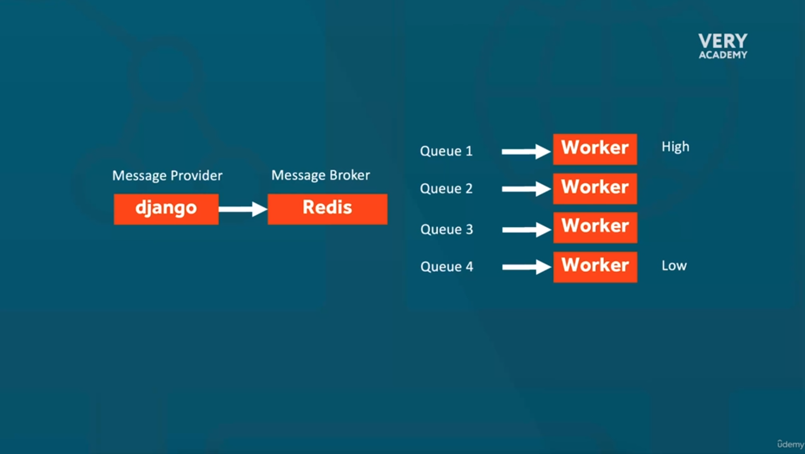

# Django Celery Mastery: Python Asynchronous Task Processing

## Install Python

```bash
sudo apt-get update; sudo apt-get install make build-essential libssl-dev zlib1g-dev \
libbz2-dev libreadline-dev libsqlite3-dev wget curl llvm \
libncursesw5-dev xz-utils tk-dev libxml2-dev libxmlsec1-dev libffi-dev liblzma-dev -y

curl https://pyenv.run | bash

echo 'export PYENV_ROOT="$HOME/.pyenv"' >> ~/.bashrc
echo 'export PATH="$PYENV_ROOT/bin:$PATH"' >> ~/.bashrc
echo -e 'if command -v pyenv 1>/dev/null 2>&1; then\n eval "$(pyenv init -)"\nfi' >> ~/.bashrc

exec "$SHELL"

pyenv install 3.9.5
pyenv global 3.9.5
pip3 install virtualenv
virtualenv env39/ -p python3.9.5
source ~/env39/bin/activate
```

## Install requeriments

```bash
pip3 install django==4.2.2
django-admin startproject dcelery
cd dcelery/
pip install celery==5.3.0
pip install redis==4.5.5
pip install pika==1.3.2
pip install django-celery-beat==2.5.0

pip freeze > requirements.txt
```

## Deploy with Docker Compose

```bash
docker stop $(docker ps -aq) && docker rm $(docker ps -aq) && docker rmi $(docker images -aq)
docker-compose up -d --build
```

## Inside Container django

```sh
./manage.py startapp cworker
```

## Celery Flow

Introduccing


Tasks Routing


Priority



Commands

```sh
celery -A dcelery inspect active
celery -A dcelery inspect active_queues
```

Tests

```sh
./manage.py shell
```

```python
from celery import group
from newapp.tasks import tp1, tp2, tp3, tp4
tp1.delay()
tp2.delay()
tp3.delay()
tp4.delay()
```

```python
from celery import group
from newapp.tasks import tp1, tp2, tp3, tp4
tasks_group = group(tp1.s(), tp2.s(), tp3.s(), tp4.s())
tasks_group.apply_async()
```

```python
from celery import chain #depend result before
from newapp.tasks import tp1, tp2, tp3
tasks_chain = chain(tp1.s(), tp2.s(), tp3.s()) #argument one task pass to other next task
tasks_chain.apply_async()
```

```python
from dcelery.celery import t1,t2,t3
t2.apply_async(priority=5)
t1.apply_async(priority=6)
t3.apply_async(priority=9)
t2.apply_async(priority=5)
t1.apply_async(priority=6)
t3.apply_async(priority=9)
```

```python
from dcelery.celery import t1
t1.apply_async(args=[5,10], kargs={"message": "The sum is"})
```

```python
from dcelery.celery import t1
result = t1.apply_async(args=[5,10], kargs={"message": "The sum is"})
print(result.get())
```

```python
from dcelery.celery_tasks.ex1_try_except import my_task
my_task.delay()
```

```python
from dcelery.celery_tasks.ex2_try_task_class import my_task
my_task.delay()
```

```python
from dcelery.celery_tasks.ex3_auto_retry import my_task
my_task.delay()
```

```python
from dcelery.celery_tasks.ex4_error_handling_groups import run_tasks
run_tasks()
```

```python
from dcelery.celery_tasks.ex5_error_handling_chain import run_task_chain
run_task_chain()
```

```python
from dcelery.celery_tasks.ex6_dead_letter_queue import run_task_group
run_task_group()
```

```python
from dcelery.celery_tasks.ex7_task_timeouts_revoking import long_running_task
long_running_task.delay()

from dcelery.celery_tasks.ex7_task_timeouts_revoking import execute_task_examples
execute_task_examples()
```

```python
from dcelery.celery_tasks.ex8_linking_result_callbacks import run_task
run_task()
```

```python
from dcelery.celery_tasks.ex9_task_signals_graceful_shutdown_and_cleanup import run_task
run_task()
```

## Sentry


```bash
pip install --upgrade sentry-sdk[django]
```

```python
from dcelery.celery_tasks.ex10_Error_Tracking_and_Monitoring_with_Sentry import divide_numbers
divide_numbers.delay(10, 0)
```

## Scheduler Django Celery Beat


